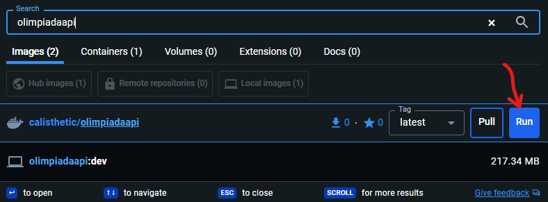

# I like kittens!

## Frontend

### Docs

Примеры кода можно посмотреть [здесь](https://svelte.dev/examples/declaring-props)

### Creating a project

```bash
npm create svelte@latest my-app
```

### Developing

```bash
npm run dev
```

### Building

```bash
npm run build
```

## Backend

**Docker** container [here](https://hub.docker.com/repository/docker/calisthetic/olimpiadaapi/general)

Open **Docker** app, search for `olimpiadaapi` and run it

! Don't forget to change api url in [api-context.js](https://github.com/Calisthetic/svelte-fun/tree/main/src/lib/utils/api-context.js)


